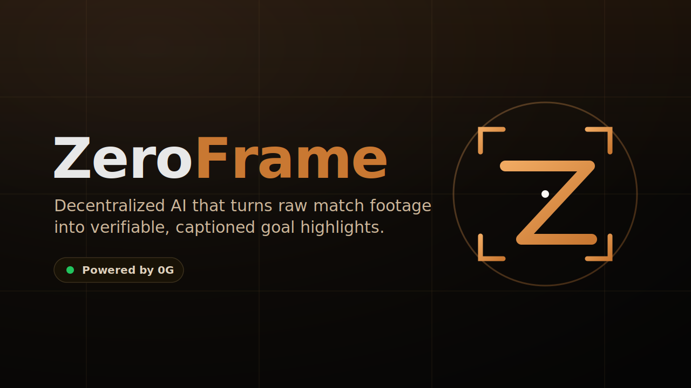
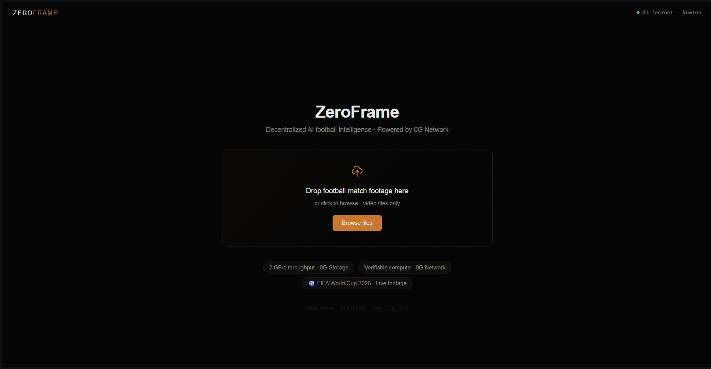
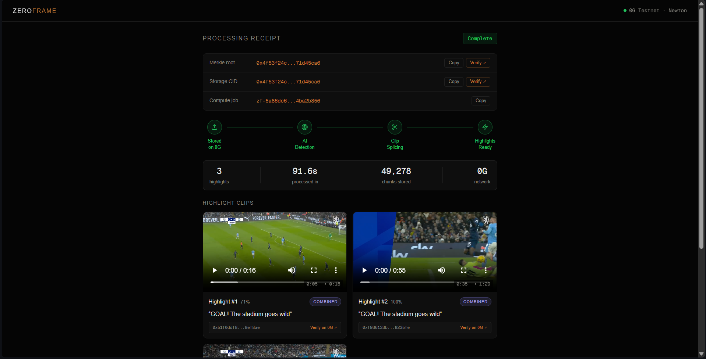

<p align="center">
  
</p>

# ⚽ ZeroFrame

**A decentralized AI video pipeline that turns raw football footage into verifiable highlight reels — powered by the 0G network.**

ZeroFrame ingests a full match, detects goal moments from crowd-noise spikes, splices them into a highlight clip with `ffmpeg`, stores the result on **0G Storage**, and generates broadcast-style captions through **0G Compute** inference — returning a content-addressed CID and a verifiable compute response for every clip.

> Built for **Zero Cup · 0G Global Vibe Coding Tournament**.

**[Live demo](https://zeroframe-coral.vercel.app) · [Demo video](https://drive.google.com/file/d/1JC0OlfsarFDlhGGeyuRZffaZeBqj0dJw/view) · [Repository](https://github.com/Aaryan-Sharma-5/ZeroFrame)**

<p align="center">
  
  
  
  
  
</p>

<p align="center">
  
  <br><em>Drop in raw match footage — uploaded straight to 0G Storage from the browser.</em>
</p>

---

## ✨ What it does

| Stage | What happens | Tech |
|-------|--------------|------|
| **1 · Ingest** | Raw match video is uploaded and queued for async processing. | FastAPI + Redis/RQ |
| **2 · Analyze** | The audio track is scanned for global RMS spikes that mark heavy crowd reactions (goals). | librosa (Python) |
| **3 · Splice** | Detected timestamps drive precise cuts, stitched into one highlight reel. | ffmpeg (input-seek) |
| **4 · Store** | The reel and each clip are pushed to decentralized storage, yielding a CID per artifact. | 0G Storage (Go CLI) |
| **5 · Caption** | A caption is generated per clip and tagged with a verifiable inference response ID. | 0G Compute Router |
| **6 · Deliver** | The browser streams the clip over HTTP range requests and renders its proof surface. | Next.js |

---

## 🏗️ Architecture

```
     [ Raw Match Video ]
              │  POST /upload  (multipart)
              ▼
     [ FastAPI ]  ── thin orchestration: mints job_id, runs 0G Storage Go CLI,
              │       enqueues "worker.process_video_job", returns job_id
              ▼
     [ Redis + RQ Queue ]  ── asynchronous task hand-off
              │
              ▼
     [ Self-hosted Worker ]  ── librosa audio-spike detection → ffmpeg splice
              │                  → 0G Storage upload → 0G Compute caption
              ▼
     [ 0G Storage + 0G Compute ]  ── decentralized media + inference proofs
              │
              ▼
     [ Next.js Frontend ]  ── polls GET /status/{job_id} every 3s,
                              streams clips, renders CIDs + compute response IDs
```

**Deployed (no-VPS, free tier):** Next.js frontend on **Vercel** → FastAPI + Redis on **Render** → the video worker as a serverless GPU container on **Modal** (runs on trigger, not always-on) → **0G Storage + 0G Compute** on the Galileo testnet. The worker writes job results straight back to Render's Redis. See [docs/DEPLOYMENT.md](docs/DEPLOYMENT.md) for live URLs, the demo walkthrough, and the pre-demo checklist.

### Why 0G is required
- **Storage** — the match footage and every highlight clip live on 0G Storage, each addressed by a cryptographic CID (merkle root). No centralized blob store.
- **Compute** — per-clip captions are produced by the **0G Compute Router** (OpenAI-compatible, TEE-attested), and the response `id` is the verifiable artifact.

Remove 0G and the project loses both its storage layer and its proof surface.

---

## 🧱 Stack

- **Frontend** — Next.js 16 · React 19 · TypeScript · Tailwind v4 · Framer Motion
- **Backend** — FastAPI (thin orchestration; no ML/video libraries imported)
- **Worker** — Python 3.11 · librosa · ffmpeg · YOLOv8 · OpenAI client → 0G Compute Router
- **Infra** — Redis + RQ · 0G Storage · 0G Compute · 0G Galileo Testnet

---

## 🚀 Run locally

The whole stack (Redis + API + worker) runs via Docker Compose.

```bash
# 1. Configure credentials
cp backend/.env.example backend/.env     # add your funded ZG_PRIVATE_KEY + ZG_COMPUTE_API_KEY
cp frontend/.env.example frontend/.env

# 2. Boot Redis, the FastAPI API, and the RQ worker
docker compose up --build

# 3. Start the frontend
cd frontend && npm install && npm run dev
```

Then open <http://localhost:3000>, drop in a match clip, and watch the pipeline.

### Without Docker
```bash
# Redis
redis-server

# API  (terminal 2)
cd backend && pip install -r requirements.txt && uvicorn main:app --reload

# Worker (terminal 3)
cd worker && pip install -r requirements.txt && rq worker zeroframe
```

---

## ⚙️ Configuration

Backend / worker (`backend/.env`):

```
ZG_PRIVATE_KEY=your_0g_wallet_private_key
ZG_STORAGE_NODE_URL=https://indexer-storage-testnet-turbo.0g.ai
ZG_RPC_URL=https://evmrpc-testnet.0g.ai
REDIS_URL=redis://localhost:6379/0

# 0G Compute (worker) — OpenAI-compatible inference Router
ZG_COMPUTE_ROUTER_URL=https://router-api.0g.ai/v1
ZG_COMPUTE_API_KEY=your_router_api_key_from_pc.0g.ai
ZG_COMPUTE_MODEL=minimax-m3        # free + TEE-attested on testnet
```

Frontend (`frontend/.env`): see [frontend/.env.example](frontend/.env.example).

---

## 🔍 Proof surface

<p align="center">
  
  <br><em>The processing receipt: 0G Storage CIDs, the live pipeline, and captioned goal highlights.</em>
</p>

For each completed job the UI shows what is genuinely verifiable — and labels it honestly:

| Value | Meaning |
|-------|---------|
| **Merkle root / Storage CID** | Root content identifier of the uploaded footage on 0G Storage |
| **Clip CID** | CID of each highlight clip on 0G Storage |
| **Caption** | Generated by 0G Compute inference from event metadata |
| **0G Compute response ID** | `chatcmpl-…` ID returned by the 0G Router inference call |

---

## ⚠️ Honest limitations (group-stage MVP)

- **Detection is audio-only in practice.** The YOLOv8 ball-confirmation pass rarely fires on real broadcast footage; the audio RMS spike anchor carries detection. Validated on a real 2-minute clip (isolated both goals, ignored midfield) — not yet a robust multimodal engine.
- **No wallet-connect UI.** Uploads are signed by a private-key wallet from environment config. Wallet-connect is Round 2.
- **No custom smart contracts** are deployed for the group stage.
- **Crash recovery is minimal** — a worker OOM mid-job leaves status at `processing` until a 24h TTL clears it.

See [docs/ARCHITECTURE.md](docs/ARCHITECTURE.md) for the full architectural specification, data-flow, and job-state contract.
